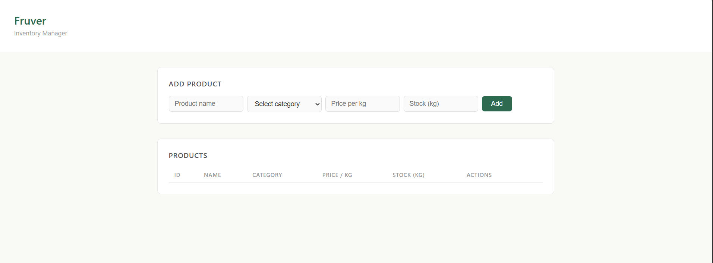

# Fruver Inventory API 🥦

REST API for managing a fruit and vegetable store inventory, built with Java and Spring Boot.

## Tech Stack

- Java 21
- Spring Boot 3.5
- Spring Data JPA
- H2 Database
- HTML + CSS + JavaScript

## Features

- Add, edit and delete products
- Categories: Fruits, Vegetables, Tubers, Herbs
- Low stock alerts (under 5 kg)
- Web interface included

## How to run

1. Clone the repository
2. Open with IntelliJ IDEA
3. Run `InventoryApiApplication.java`
4. Open `http://localhost:8080` in your browser

## Preview

> 